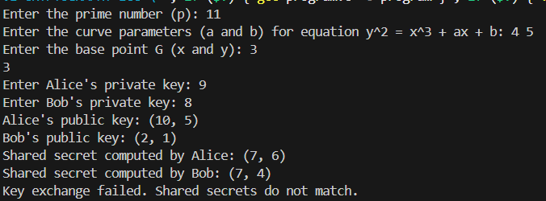

## EX 11 : IMPLEMENTATION OF ELLIPTIC CURVE CRYPTOGRAPHY (ECC)

## AIM:

To implement the Elliptic Curve Cryptography (ECC) algorithm for basic point addition and scalar multiplication on an elliptic curve over a finite field.

## ALGORITHM:

1. Start the program.
2. Select the parameters of the elliptic curve:
   • Choose a prime number p (field size).
   • Choose curve parameters a and b for the equation:
   y2 = x3 + ax + b modp
3. Define a base point (generator) G(x, y) on the curve.
4. Choose private keys:
   • User A chooses a random private key a.
   • User B chooses a random private key b.
5. Compute public keys:
   • User A computes public key A = a _ G (scalar multiplication).
   • User B computes public key B = b _ G.
6. Exchange public keys.
7. Each user computes the shared secret:
   • User A computes: S = a _ B
   • User B computes: S = b _ A
   • Since ECC is based on scalar multiplication, both S values are equal.
8. The shared secret is now established.
9. End the program.

## PROGRAM:
```c
#include <stdio.h>
typedef struct {
    long long int x, y;
} Point;

long long int modInverse(long long int a, long long int m) {
    long long int m0 = m, t, q;
    long long int x0 = 0, x1 = 1;
    if (m == 1) return 0;
    while (a > 1) {
        q = a / m;
        t = m;
        m = a % m, a = t;
        t = x0;
        x0 = x1 - q * x0;
        x1 = t;
    }
    if (x1 < 0) x1 += m0;
    return x1;
}

Point pointAddition(Point P, Point Q, long long int a, long long int p) {
    Point R;
    long long int lambda;
    
    if (P.x == Q.x && P.y == Q.y) {
        lambda = (3 * P.x * P.x + a) * modInverse(2 * P.y, p) % p;
    } else { 
        lambda = (Q.y - P.y) * modInverse(Q.x - P.x, p) % p;
    }

    R.x = (lambda * lambda - P.x - Q.x) % p;
    R.y = (lambda * (P.x - R.x) - P.y) % p;
    
    R.x = (R.x + p) % p;
    R.y = (R.y + p) % p;

    return R;
}

Point scalarMultiplication(Point P, long long int k, long long int a, long long int p) {
    Point result = P;
    k--;
    while (k > 0) {
        result = pointAddition(result, P, a, p); // Add the point to itself (k times)
        k--;
    }

    return result;
}

int main() {
    long long int p, a, b, privateA, privateB;
    Point G, publicA, publicB, sharedSecretA, sharedSecretB;

    printf("Enter the prime number (p): ");
    scanf("%lld", &p);
    printf("Enter the curve parameters (a and b) for equation y^2 = x^3 + ax + b: ");
    scanf("%lld %lld", &a, &b);
    printf("Enter the base point G (x and y): ");
    scanf("%lld %lld", &G.x, &G.y);

    printf("Enter Alice's private key: ");
    scanf("%lld", &privateA);
    printf("Enter Bob's private key: ");
    scanf("%lld", &privateB);

    publicA = scalarMultiplication(G, privateA, a, p); 
    publicB = scalarMultiplication(G, privateB, a, p); 

    printf("Alice's public key: (%lld, %lld)\n", publicA.x, publicA.y);
    printf("Bob's public key: (%lld, %lld)\n", publicB.x, publicB.y);

    sharedSecretA = scalarMultiplication(publicB, privateA, a, p); 
    sharedSecretB = scalarMultiplication(publicA, privateB, a, p); 

    printf("Shared secret computed by Alice: (%lld, %lld)\n", sharedSecretA.x, sharedSecretA.y);
    printf("Shared secret computed by Bob: (%lld, %lld)\n", sharedSecretB.x, sharedSecretB.y);

    if (sharedSecretA.x == sharedSecretB.x && sharedSecretA.y == sharedSecretB.y) {
        printf("Key exchange successful. Both shared secrets match!\n");
    } else {
        printf("Key exchange failed. Shared secrets do not match.\n");
    }

    return 0;
}
```

## OUTPUT:


## RESULT:

The ECC program successfully demonstrates point addition and scalar multiplication on an elliptic curve over a finite field, and the simulation has been executed and verified successfully.
